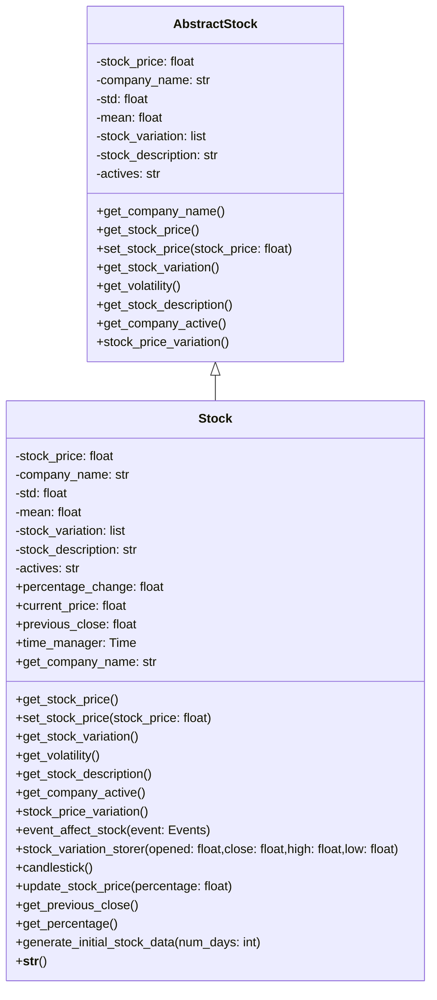

# FUNDS-AMENTALS

## Problem

We discover that the people around us *including us* don't usually know how to use a stock market, this is a little disappointing because the they are losing a great possibility; we are not saying that you will solve are your finance problems investing in the stock market but we want that more people know about the stock market and discover the possibilities that it offer.

## Solution

To solve this situation, we intend to make a game that simulates a stock market behavior. For simplicity purposes the game will initially be a text base game, which means that all the operations and interactions that you will have with this *game*, will be by Terminal. We decide to make this like a game because games are very good tools to teach different skills. With this game we intend to teach how a stock market changes when different events in the world happen. The player will learn to make predictions and earn money based on this events. It will be like a kindergarten for new investors, including some important thing but not having all the thing that happens in a stock market (at the moment).

## How we approach the problem

Since the problem is a lack of knowledge on how stock markets work and games have historically been a way in which learning is imparted we decided to make a game as a tutorial to start in stock market investment so, we decide starting for the beginning, researching about stock market principal things, with this information we abstract the things that we consider that were more important in:

### Events
<details><summary>Events</summary>
<p>


Stock market events are spontaneous occurrences that can significantly influence the prices of stocks globally. These events include a variety of factors such as economic indicators, geopolitical developments, technological advancements, natural disasters, regulatory changes, and shifts in market sentiment. Due to their unpredictable nature, these events can cause daily fluctuations in stock prices. To effectively capitalize on these fluctuations, investors must stay informed and analyze these events to identify potential opportunities for profit. Investing in response to such events can often be more profitable than traditional saving methods, as it allows investors to leverage market dynamics and make strategic decisions based on the latest information. 

In managing such events programmatically, a Python class like Events can help simulate their impact on stock prices. This class tracks various attributes of an event, including its name, description, impact, and duration. It also manages the event's state (active or inactive) and adjusts the stock's price impact based on random percentage changes. Functions like create_event(), and deactivate_event() facilitate the creation, monitoring, and deactivation of events, respectively. These tools are essential for understanding and responding to the dynamic nature of financial markets, making investing a more informed and strategic endeavor.
</p>
</details> 


### Events Storer

<details><summary>Events Storer</summary>
<p>

This object is used to save all events of the same type, for example, an event storer ´War´ have all the events of type War that affect each stock. We also discussed in this class the managing of each event, activating, deactivating and other methods that we could make to an event.

</p>
</details>


### Stocks


<details><summary>Stocks</summary>
<p>

These are the things that the people could buy for having a percentage of the enterprise; this has a name (company name), a value, a variation in the time that register of how the stock value oscillate in the time (this oscillation is "random", because you couldn't predict how it will oscillate will effectivity), and for the last one, the events that affect the stock value, this make that the stock value has a tendency along the time. After having these things about `Stocks`, we decide to create a class diagram with the information that we abstract, trying to define methods and class attributes that needs the object; during this process we define, create and delete things, making the program totally different from the diagram. 

We decide to make an 
`abstractstock` class trying to prepare the class father which stocks will inherit and trying to create a blueprint for another class that could be similar to stocks (but it is in discussion).




As we said, events has 3 principal attributes, stock_price, company_name and stock_variation, the first and second only should receive float and string values any time that we instance the class stock for creating an object type stock. But for making the stock_variation(that has the variation of our stock values), we have to create a method that generates randomly this stock_value_data, trying to emulate the randomness of the stock market. 

After some investigation, we discover that in the stock market there is something called `volatility`, that could be defined in the financial markets context like a measure that allows us to know the fluctuations and variability of the prices of an asset over a period of time; there are some types of it depending on how you calculate this `volatility`. ([here are info about it](https://clubdecapitales.com/educacion/que-es-la-volatilidad-en-los-mercados-financieros)). 

We decide to use and calculate the historical `volatility`, that calculates the volatility as the standard deviation of daily returns; it could be a little imprecise because this model can't reflect the impact of events in the variability of the prices of an asset and you if you see, the stock markets don't use to behavior like a standard deviation, but we want to create a game that is similar to a stock market that could give the people an approximation to this market and don't need to be exactly like it.


For calculate this historical `volatility` we decide to use the log normal method that has the following steps ([reference info](https://statologos.com/volatilidad/)):

#### Find the daily closing price
We will make this using a module called `yfinance` that can get the closing price of stocks of an enterprise in a period of time (we will take some real enterprises for simplifying this step)


#### Calculate the daily logarithmic returns.
For making this step we will use the module `numpy`, that helps us to made operations between big amount of data

```python
daily_stock_variation = np.array([100, 102, 101, 105, 107])
daily_logarithmic_returns = np.diff(np.log(daily_stock_variation)) # Calculate the daily logarithmic returns
print(daily_logarithmic_returns) #  [ 0.00995033  0.08535985 -0.09531018  0.0295588 ]
```


#### Find the standard deviation of previous step
For making this step we will use the module `numpy`, that helps us to made operations between big amount of data

```python
daily_stock_variation = np.array([100, 102, 101, 105, 107])
daily_logarithmic_returns = np.diff(np.log(daily_stock_variation)) # Calculate the daily logarithmic returns
standard_deviation = np.std(daily_logarithmic_returns) # Calculate the standard deviation of daily logarithmic returns
print(standard_deviation) # 0.01738779001689414
```


### Using of volatility
After all this thing that we made we will use the volatility for generating the variation of the stock price, we decide to use again `numpy` for this work because it will calculate the `mean` and `standart deviation` of daily_logarithmic_returns, for creating this random data following a normal distribution (that is the model that we are following), using the following script:

```python

daily_stock_variation = np.array([100, 102, 101, 105, 107])
daily_logarithmic_returns = np.diff(np.log(daily_stock_variation)) # Calculate the daily logarithmic returns

standard_deviation = np.std(daily_logarithmic_returns) # Calculate the standard deviation of daily logarithmic returns

mean = np.mean(daily_logarithmic_returns) # Calculate the mean of logarithmic returns

rng = np.random.default_rng() # Create this object that will generate my random data
volatility_change = rng.normal(loc= mean, scale= std, size=1) # Uses a method of the object for creating this random data following a standard deviation
stock_price = stock_price * (1 +  volatility_change) # Aplicate the variation in the stock_price using volatility_change that is a percentage
stock_price =(round(stock_price, 2)) # And change this will be stored in stock_variation

```


### Use
After the previous explanation about how we decide to create and generate the data for stocks, we are going to talk about the class stock. In this class, we create objects of type ´Stock´ that start with some init values. In this class, we can generate stock variation with the previous steps, and we could save this variation. We could apply a tendency (percentage) to the variation and also generate a graphic.

</p>
</details>


### World
<details><summary>World</summary>
<p>

This is the place where stocks and events use to act, so this will be compounded by events, events_storer, stocks, time and news also, this will have to some functions and methods that regulate the behavior of events and stocks and how they will interact. One of these functions has to create the objects events and stocks for starting the games. We decided to create a time for each stock to process the individual data and not generate some errors when running the program.

</p>
</details>


### Player
<details><summary>Player</summary>
<p>

This class has the proposite of having all the comands that will let the player interactue with the project, like, sell_stocks, buy_stocks, get_portfolio, get_balance.
In it we realice some process to save the data that will be show when the player make get portfolio or get balance. This data will be update when the player make buy stocks and sell stocks.

</p>
</details>


### View

<details><summary>View</summary>
<p>
It is compounded by an instance of Controller, and we initialize it at the start of the program.
This class gets all the player inputs, which means that it gets a string, and depending on whether the string is defined and exists in a list of commands that the player could check, it executes a process that passes their string to Controller. If the command doesn't exist, this will output a message saying that the command doesn't exist.
</p>
</details>

### Controller

<details><summary>Controler</summary>
<p>
It is compounded by an instance of World, and we initialize it at the start of the program.
This gets the string from View, this will compare the string with some conditional, and if it gets True, it will execute a method from World in his instance.
</p>
</details>

### Time

<details><summary>New Timer</summary>
<p>

This class was created to admin the time of the program, of course, but has another function that is used to view the date of each candle in the candlestick, this method was integrated into stocks.

</p>
</details>

Finally, there is another important class that shows the events that are affecting stocks around the world.

### News

<details><summary>News</summary>
<p>

How we explained it before: that class is responsible for showing what is happening in the world. This class shows the headlines of all available news based on current events (news titles) in a list, and have another method to show the description or better said article for a particular event.


</p>
</details>


## Class diagram

```mermaid
classDiagram
    class Events {
        -event_name: str
        -stock_actives: str
        -stock_name: str
        -description: str
        -impact: str
        -percentage: float
        -state: str
        -event_duration: float
        -timer: float
        -event_percentage_range: tuple
        +get_event_name()
        +description()
        +get_impact()
        +get_percentage()
        +get_state()
        +get_timer()
        +get_event_duration()
        +get_affected_stock()
        +set_timer()
        +set_impact(impact: str)
        +set_percentage(percentage: float)
        +tendence_selector()
        +change_impact()
        +state_activer()
        +state_desactiver()
    }

    class EventsStore {
        -name: str
        -sons_list: list
        -sons_active_list: list
        +__repr__()
        +__iter__()
        +__hash__()
        +__eq__(other: EventsStorer)
        +reach_limit() 
        +select_son()
        +active_sons()
        +desactive_sons()
        +get_active_sons()
        +name()
    }

    class AbstractStock {
        -stock_price: float
        -company_name: str
        -std: float
        -mean: float
        -stock_variation: list
        -stock_description: str
        -actives: str
        +get_company_name()
        +get_stock_price() 
        +set_stock_price(stock_price: float)
        +get_stock_variation()
        +get_volatility()
        +get_stock_description()
        +get_company_active()
        +stock_price_variation()
    }

    class Stock {
        -stock_price: float
        -company_name: str
        -std: float
        -mean: float
        -stock_variation: list
        -stock_description: str
        -actives: str
        +percentage_change: float
        +current_price: float
        +previous_close: float
        +time_manager: Time
        +get_company_name: str
        +get_stock_price() 
        +set_stock_price(stock_price: float)
        +get_stock_variation()
        +get_volatility()
        +get_stock_description()
        +get_company_active()
        +stock_price_variation()
        +event_affect_stock(event: Events)
        +stock_variation_storer(opened: float,close: float,high: float,low: float)
        +candlestick()
        +update_stock_price(percentage: float)
        +get_previous_close()
        +get_percentage()
        +generate_initial_stock_data(num_days: int)
        +__str__()
    }

    class Controller {
        -world: World
        +eval_comad(command: str) 
    }

    class Player {
        -player_portfolio: dict
        -player_portfolio["USD"]: float
        -player_money_invested_in_stock_always: dict
        -player_total_balance: dict
        +player_money()
        +get_player_money_invested_in_stock()
        +get_player_balance()
        +save_player_money_invested_in_stock(stock: Stock, quantity: int)
        +validate_input_quantity(func)
        +buy_stock(stock: Stock, quantity: int) 
        +sell_stock(stock: Stock, quantity: int)
         +get_portfolio()
        +get_stock_amount(stock: Stock)
        +print_generator(iterable) 
        +get_portfolio()
        +print_player_money_invested_in_stock()
        +print_player_balance()
        +__str__()
    }

    class View {
        -controler: Controller
        +read() 
        +run() 
    }

    class World {
        -events: dict
        -stocks: dict
        -player: Player
        +time_doors: Time
        +time_edison: Time
        +time_game_pause: Time
        +time_araboilcompany: Time
        +time_mvidia: Time
        +time_pear: Time
        +time_usweapons: Time
        +news: News
        +load_stocks()
        +load_events()
        +get_not_reach_limit_storer()
        +active_events_sons()
        +verify_all_active()
        +posibility_active_event()
        +create_event()
        +calculate_percentage()
        +pass_percentage_to_stocks()
        +desactive_event()
        +run()
        +show_news()
        +read_news(event_name: str) 
        +buy_stock(stock_name: str, amount: int) 
        +sell_stock(stock_name: str, amount: int) 
        +next_week() 
        +see_portfolio()
        +see_market()
        +candle_stick() 
    }
    class Time {
        +current_date
        +get_next_sate()
        +get_date()
    }
    class News {
        +event_storers: dict
        +get_news_titles()
        +get_news_article(event_name: str)
    }
    EventsStore *-- Events
    AbstractStock <|-- Stock
    Controller *-- World
    Player --* Stock
    View *-- Controller
    World *-- Events
    World *-- Stock
    World *-- Player
    World *-- Time
    World *-- News
    Stock *-- Time
    News *-- EventsStore

```


### Download and usage


## Running Virtual Enviroment

Before running the enviroment, if you are running in WindowsOS you need to have Execute policy to unrestricted. You can do this by executing the command ```Set-ExecutionPolicy -ExecutionPolicy Unrestricted -Scope CurrentUser ``` in a CMD.

To create a virtual enviroment we used virtualenv and used the following [tutorial](https://www.youtube.com/watch?v=TNtrAvNNxTY) to created. To open the enviroment, you need to execute ```.\env\Scripts\activate``` on a terminal inside Funds-Amentals directory. Inside the enviroment there are all the needed pip moduels to execute the game.

Once the virtual enviroment is running, you will need to run the index.py file using a python 3 version.

## Running the program 

To run the game after entering the virtual enviroment you need to execute the index.py file using python. The comand goes as follows: ```python index.py```

## Basic Commands

```
help [name of a command]
read_news
buy_stock <name of the company> <amount of stocks>
sell_stock <name of the company> <amount of stocks>
see_portfolio
next_week
exit
```


## Suggestions

If you have any suggestion for improving the repo you are welcome!!
