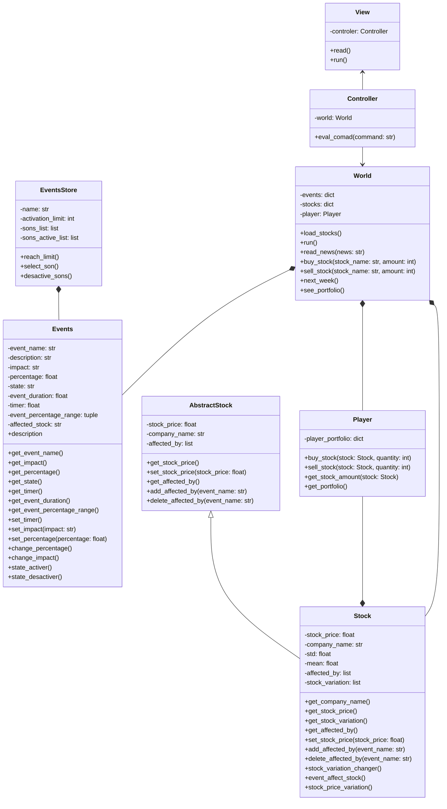

# FUNDS-AMENTALS

## Problem

The people don't know how to use a stock market.

## Solution

To solve this situation we intend to make a game that simulates stock market behaviour. For simplicity porposes the game will iniciatially be text base game.

## How we approach the problem

Since the problem is a lack of knowledge on how stock markets work and games have historically been a way in which learning is imparted we decided to make a game as a tutorial to start in stock market investment.

## Class diagram

## Download and usage

