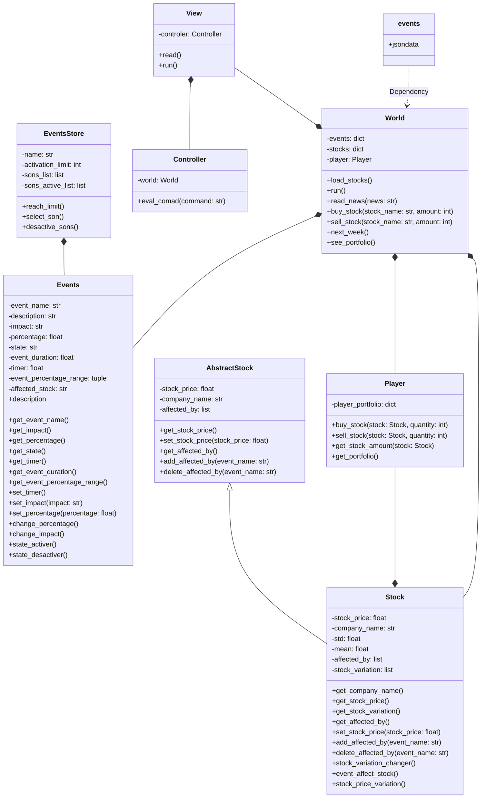

# FUNDS-AMENTALS

## Problem

The people don't know how to use a stock market. We discover that the people around us *including us*, this is a little disappointing because the people are losing a great possibility; we are not saying that you will solve are your finance problems investing in the stock market, we want that more people know about this market and discover the possibilities that it offer.

## Solution

To solve this situation we intend to make a game that simulates stock market behaviour. For simplicity porposes the game will iniciatially be text base game, it means that all the operations and interactions that you will have with this *game*, will be by Terminal. We decide to make this like a game because the stock market it's like a game, you have to sort some problems if you want to reach an objective (like winning money), make predictions and decide about how you will react to face the problems for not lossing the game (lossing all your actives). It will be like a kindergarten for new investors, including some important thing but not having all the thing that happens in a stock market (at the moment).

## How we approach the problem

Since the problem is a lack of knowledge on how stock markets work and games have historically been a way in which learning is imparted we decided to make a game as a tutorial to start in stock market investment so, we decide statring for the begining, researching about stock market principal things, with this information we abstract the things that we consider that were more important in:

### Events

Stock market events are spontaneous occurrences that can significantly influence the prices of stocks globally. These events include a variety of factors such as economic indicators, geopolitical developments, technological advancements, natural disasters, regulatory changes, and shifts in market sentiment. Due to their unpredictable nature, these events can cause daily fluctuations in stock prices. To effectively capitalize on these fluctuations, investors must stay informed and analyze these events to identify potential opportunities for profit. Investing in response to such events can often be more profitable than traditional saving methods, as it allows investors to leverage market dynamics and make strategic decisions based on the latest information. 

In managing such events programmatically, a Python class like Events can help simulate their impact on stock prices. This class tracks various attributes of an event, including its name, description, impact, and duration. It also manages the event's state (active or inactive) and adjusts the stock's price impact based on random percentage changes. Functions like create_event(), all_events_active(), and deactivate_event() facilitate the creation, monitoring, and deactivation of events, respectively. These tools are essential for understanding and responding to the dynamic nature of financial markets, making investing a more informed and strategic endeavor.
 

### Stocks

These are the things that the people could buy for having a percentage of the enterprise; this has a name (company name), a value, a variation in the time  thatregister of how the stock value oscilate in the time (this oscilation is "random", because you couldn't predict how it will oscile will effectivity), and for the last one, the events that affect the stock value, this make that the stock value has a tendency along the time.
After having this one things about Stocks, we decide to create a class diagram with the information that we abstract, trying to define methods and class attibutes that needs the object; during this process we define, create and delete many of this

### World

## Class diagram

## Download and usage

This will be add in the future, when the project is done

## Suggestions

If you have any suggestion for improving the repo you are welcome!!
