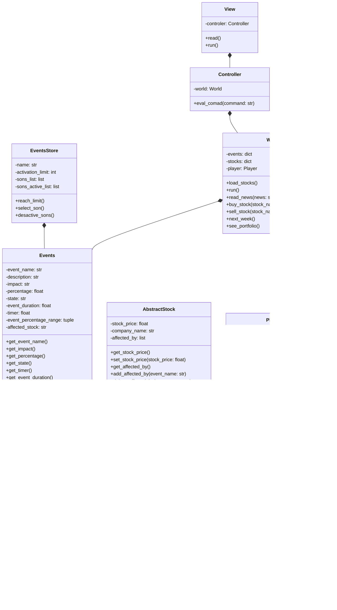

# FUNDS-AMENTALS

## Problem

The people don't know how to use a stock market. We discover that the people around us *including us*, this is a little disappointing because the people are losing a great possibility; we are not saying that you will solve are your finance problems investing in the stock market, we want that more people know about this market and discover the possibilities that it offer.

## Solution

To solve this situation, we intend to make a game that simulates stock market behavior For simplicity purposes the game will initially be a text base game, it means that all the operations and interactions that you will have with this *game*, will be by Terminal. We decide to make this like a game because the stock market it's like a game, you have to sort some problems if you want to reach an objective (like winning money), make predictions and decide about how you will react to face the problems for not losing the game (losing all your actives). It will be like a kindergarten for new investors, including some important thing but not having all the thing that happens in a stock market (at the moment).

## How we approach the problem

Since the problem is a lack of knowledge on how stock markets work and games have historically been a way in which learning is imparted we decided to make a game as a tutorial to start in stock market investment so, we decide starting for the beginning, researching about stock market principal things, with this information we abstract the things that we consider that were more important in:

### Events

Stock market events are spontaneous occurrences that can significantly influence the prices of stocks globally. These events include a variety of factors such as economic indicators, geopolitical developments, technological advancements, natural disasters, regulatory changes, and shifts in market sentiment. Due to their unpredictable nature, these events can cause daily fluctuations in stock prices. To effectively capitalize on these fluctuations, investors must stay informed and analyze these events to identify potential opportunities for profit. Investing in response to such events can often be more profitable than traditional saving methods, as it allows investors to leverage market dynamics and make strategic decisions based on the latest information. 

In managing such events programmatically, a Python class like Events can help simulate their impact on stock prices. This class tracks various attributes of an event, including its name, description, impact, and duration. It also manages the event's state (active or inactive) and adjusts the stock's price impact based on random percentage changes. Functions like create_event(), all_events_active(), and deactivate_event() facilitate the creation, monitoring, and deactivation of events, respectively. These tools are essential for understanding and responding to the dynamic nature of financial markets, making investing a more informed and strategic endeavor.
 

### Stocks

These are the things that the people could buy for having a percentage of the enterprise; this has a name (company name), a value, a variation in the time that register of how the stock value oscillate in the time (this oscillation is "random", because you couldn't predict how it will oscillate will effectivity), and for the last one, the events that affect the stock value, this make that the stock value has a tendency along the time. After having these things about `Stocks`, we decide to create a class diagram with the information that we abstract, trying to define methods and class attributes that needs the object; during this process we define, create and delete things, making the program totally different from the diagram. 

We decide to make an 
`abstractstock` class trying to prepare the class father which stocks will inherit and trying to create a blueprint for another class that could be similar to stocks (but it is in discussion).


As we said, events has 3 principal attributes, stock_price, company_name and stock_variation, the first and second only should receive float and string values any time that we instance the class stock for creating an object type stock. But for making the stock_variation(that has the variation of our stock values), we have to create a method that generates randomly this stock_value_data, trying to emulate the randomness of the stock market. 

After some investigation, we discover that in the stock market there is something called `volatility`, that could be defined in the financial markets context like a measure that allows us to know the fluctuations and variability of the prices of an asset over a period of time; there are some types of it depending on how you calculate this `volatility`. ([here are info about it](https://clubdecapitales.com/educacion/que-es-la-volatilidad-en-los-mercados-financieros)). 

We decide to use and calculate the historical `volatility`, that calculates the volatility as the standard deviation of daily returns; it could be a little imprecise because this model can't reflect the impact of events in the variability of the prices of an asset and you if you see, the stock markets don't use to behavior like a standard deviation, but we want to create a game that is similar to a stock market that could give the people an approximation to this market and don't need to be exactly like it.


For calculate this historical `volatility` we decide to use the log normal method that has the following steps ([reference info](https://statologos.com/volatilidad/)):

#### Find the daily closing price
We will make this using a module called `yfinance` that can get the closing price of stocks of an enterprise in a period of time (we will take some real enterprises for simplifying this step)


#### Calculate the daily logarithmic returns.
For making this step we will use the module `numpy`, that helps us to made operations between big amount of data

```python
daily_stock_variation = np.array([100, 102, 101, 105, 107])
daily_logarithmic_returns = np.diff(np.log(daily_stock_variation)) # Calculate the daily logarithmic returns
print(daily_logarithmic_returns) #  [ 0.00995033  0.08535985 -0.09531018  0.0295588 ]
```


#### Find the standard deviation of previous step
For making this step we will use the module `numpy`, that helps us to made operations between big amount of data

```python
daily_stock_variation = np.array([100, 102, 101, 105, 107])
daily_logarithmic_returns = np.diff(np.log(daily_stock_variation)) # Calculate the daily logarithmic returns
standard_deviation = np.std(daily_logarithmic_returns) # Calculate the standard deviation of daily logarithmic returns
print(standard_deviation) # 0.01738779001689414
```


### Using of volatility
After all this thing that we made we will use the volatility for generating the variation of the stock price, we decide to use again `numpy` for this work because it will calculate the `mean` and `standart deviation` of daily_logarithmic_returns, for creating this random data following a normal distribution (that is the model that we are following), using the following script:

```python

daily_stock_variation = np.array([100, 102, 101, 105, 107])
daily_logarithmic_returns = np.diff(np.log(daily_stock_variation)) # Calculate the daily logarithmic returns

standard_deviation = np.std(daily_logarithmic_returns) # Calculate the standard deviation of daily logarithmic returns

mean = np.mean(daily_logarithmic_returns) # Calculate the mean of logarithmic returns

rng = np.random.default_rng() # Create this object that will generate my random data
volatility_change = rng.normal(loc= mean, scale= std, size=1) # Uses a method of the object for creating this random data following a standard deviation
stock_price = stock_price * (1 +  volatility_change) # Aplicate the variation in the stock_price using volatility_change that is a percentage
stock_price =(round(stock_price, 2)) # And change this will be stored in stock_variation

```

### World

This is the place were `stocks` and `events` use to act, so this will be compound by `events` and `stocks`, also, this will have to some functions and methods that regulate the behavior of `events` and `stocks` and how they will interact, one of these functions has to create the objects `events` and `stocks` for starting the games, so, we decide save the information that this objects need in a JSON, and import this data to `world`.

### Events Storer

Also, we are planning to add a structure that will store and manage `events` objects for making it easier to world, so, we create a new class called `events_storer` that will make this work, taking of functions to world, making it easier to modify and update.

# Player

In `World` there is one thing that we are missing and is the player, so, we decide to create a `player` class that will define the portfolio that the player have, this portfolio is compound by `stocks`, it means, here is the place in which the player save and see the stocks that he own. 

### How player will interact with the program?

For last one, we need something that let the player interact with world and also give him information about what is happening in world, for this last one item we decide create `Controller` and  `View`; `Controler` as his name say, this will let the player interact with world, letting him control some process like watching his portfolio or selling stocks, it is compound by `Wolrd`, being a bridge between `World` and `View`. `View` is the part that the player see, is like the fronted of the code that will interact will the player, it is compound by `Controler`


## Class diagram


## Download and usage

This will be add in the future, when the project is done


## Suggestions

If you have any suggestion for improving the repo you are welcome!!
